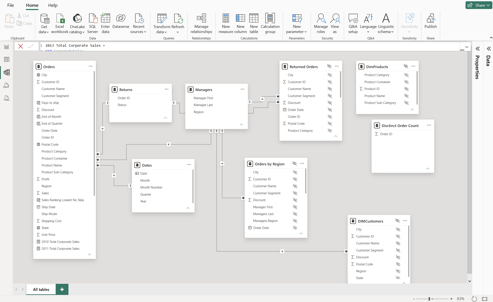
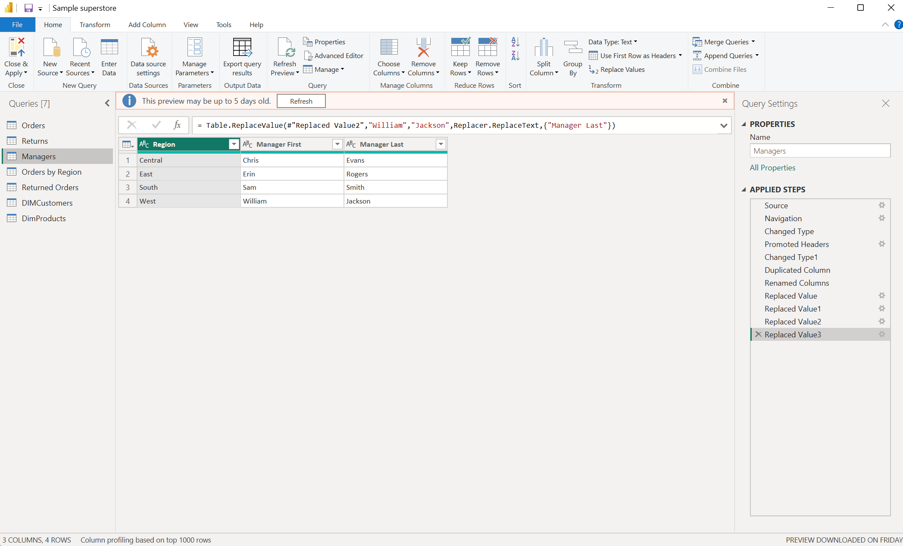
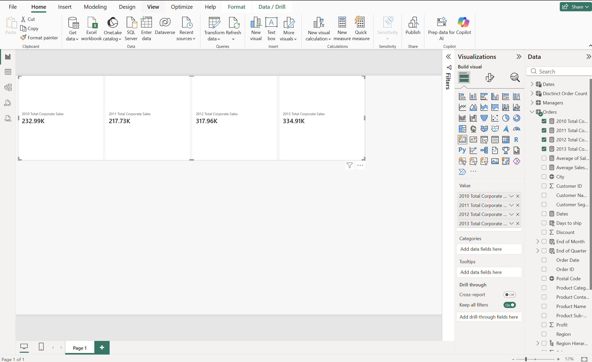

# 01 – Superstore Data Modeling

## Goal
Practise the data-preparation workflow in Power BI Desktop: load raw Excel data,
clean it in Power Query, reshape it into a star-schema model, and add DAX calculations.

## What I built

**Power Query**
- Loaded the Orders, Returns, and Users sheets from the Sample Superstore workbook
- Renamed Users to Managers, promoted the first row to headers, and built last-name
  columns by duplicating a column and replacing values
- Removed unneeded columns from Orders, filtered to five states, and sorted
- Merged Orders with Managers (on Region) and Orders with Returns into new queries
- Checked data quality with column quality, distribution, and profile

**Data model**
- Set formats (percentage, currency, dates) and geographic data categories
- Split Orders into DimCustomers and DimProducts (custom index column as the product key)
- Built a Region > State > City > Postal Code hierarchy
- Created an Orders–Returns relationship on Order ID
- Created a date table with CALENDARAUTO, marked it as the date table, and related it
  to Order Date

**DAX**
- Calculated table: distinct Order IDs
- Calculated columns: Days to Ship (DATEDIFF), sales ranking (RANKX, with and without
  skipped ranks for ties), end of month, end of quarter
- Measures: Total Sales and yearly corporate sales using variables (VAR / RETURN)

## Screenshots

### Data model

*Relationships between the Orders, Returns, and Managers tables and the dimension tables.*

### Power Query steps

*Applied steps in Power Query, showing each transformation in order.*

### Report

*Report page built on the model using the DAX measures.*

## Scope
Done in Power BI Desktop. Publishing and Service steps were covered in the course
but not practised, since they need a work or school account.

## Files
- [`sample_superstore.pbix`](./sample_superstore.pbix)

## Data
Sample Superstore workbook from the course. Not re-uploaded here.