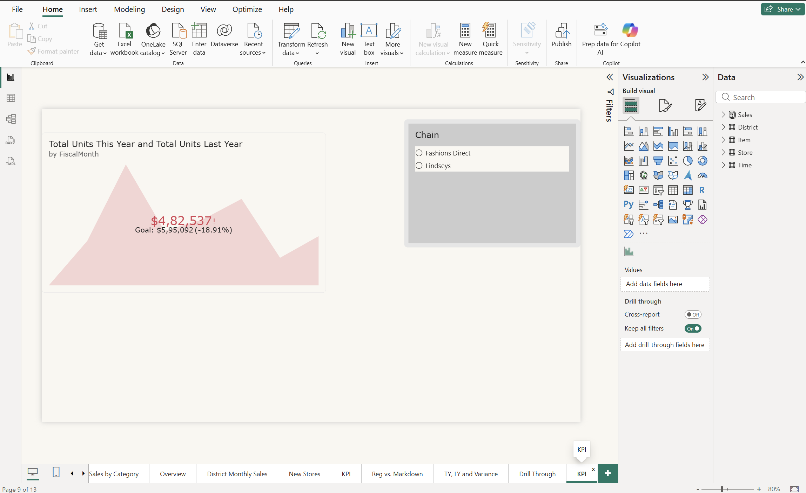
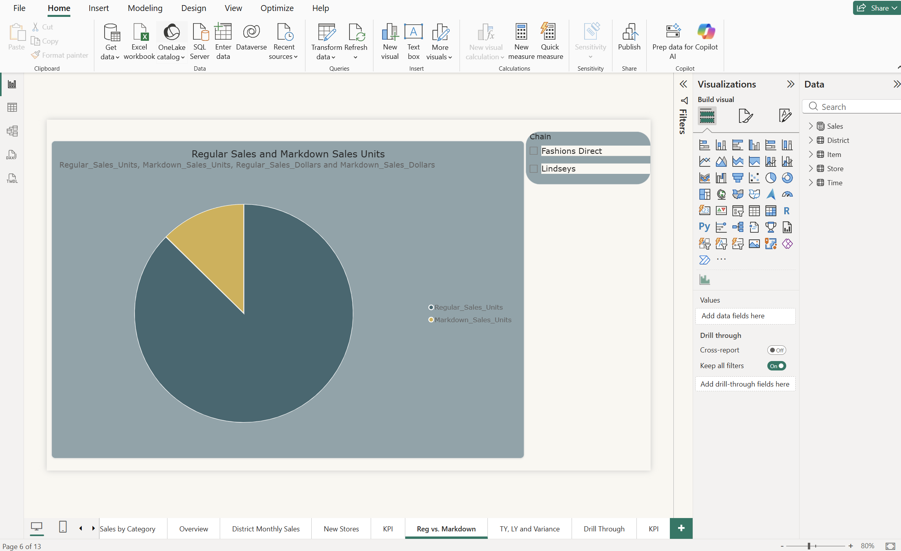
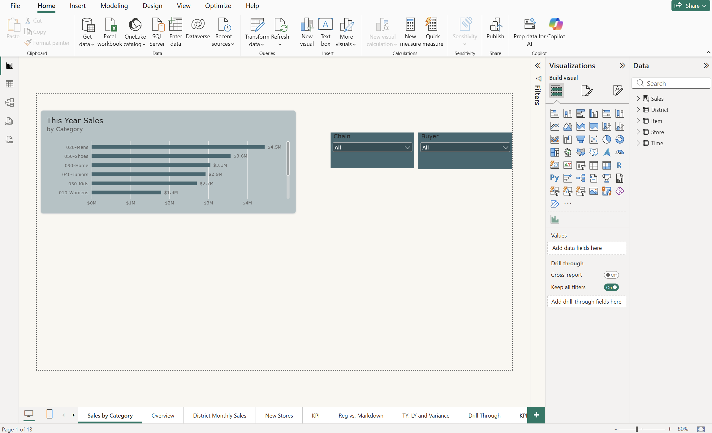
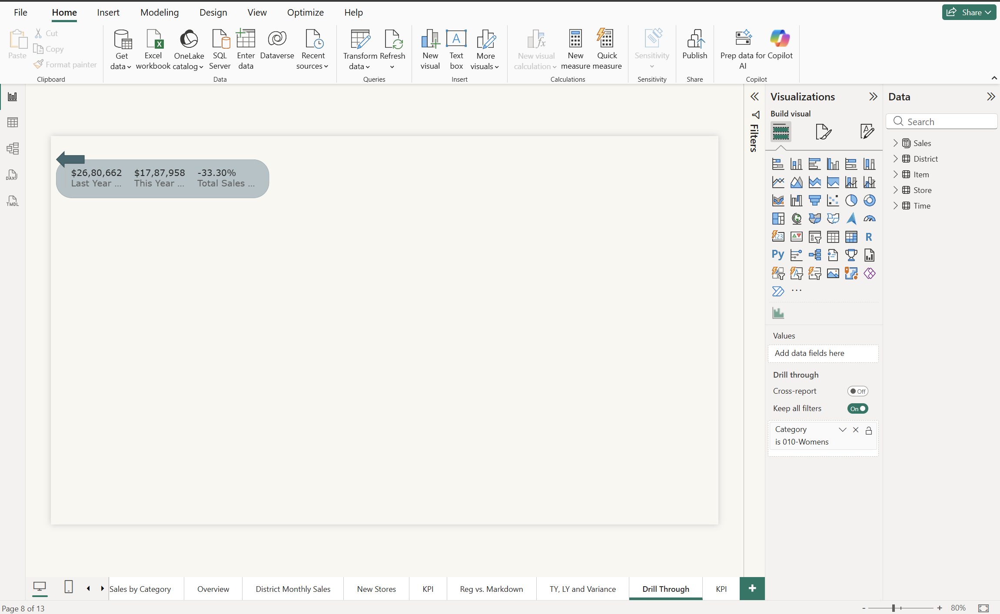

# 02 – Retail Analysis Report

## Goal
Practise building interactive report pages in Power BI Desktop: choosing visuals,
adding slicers, drill-through, and conditional formatting.

## Note on the file
`Retail_Analysis_Sample.pbix` is Microsoft's Retail Analysis sample, which ships with
pre-built pages (such as Overview). The five pages below are the ones I built.

## Pages I built

**KPI** – This year vs. last year units by fiscal month. I sorted the chart before
converting it to a KPI visual, since the KPI visual can't be sorted.

**Reg vs Markdown** – Pie chart of regular vs. markdown sales units, with sales dollars
added as tooltips.

**TY, LY and Variance** – Clustered columns comparing this year, last year, and variance
by chain, with data labels and a table using a colour scale to flag this year's sales.

**Sales by Category** – Stacked bar of this year's sales by category with Chain and
Buyer dropdown slicers.

**Drill Through Analysis** – A multi-row card page that opens when you right-click a
category on Sales by Category, filtered to that category. Includes a custom back button.

## Also done
- Synced a Chain slicer across pages
- Applied a colourblind-safe theme

## Scope
Done in Power BI Desktop. Publishing and dashboards were not practised.

## Files
- [`Retail_Analysis_Sample.pbix`](./Retail_Analysis_Sample.pbix)