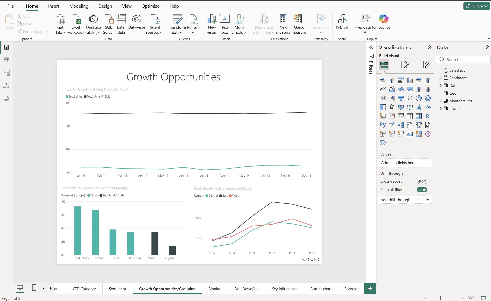
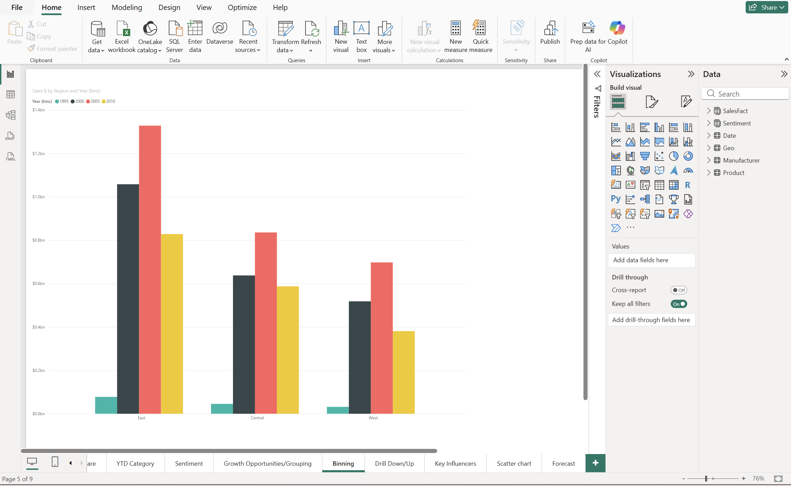
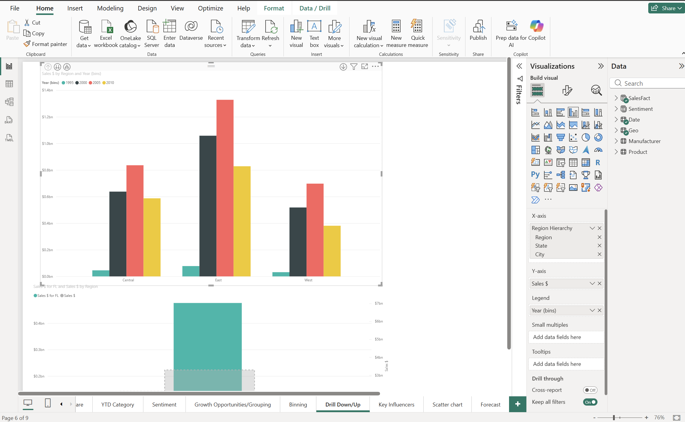
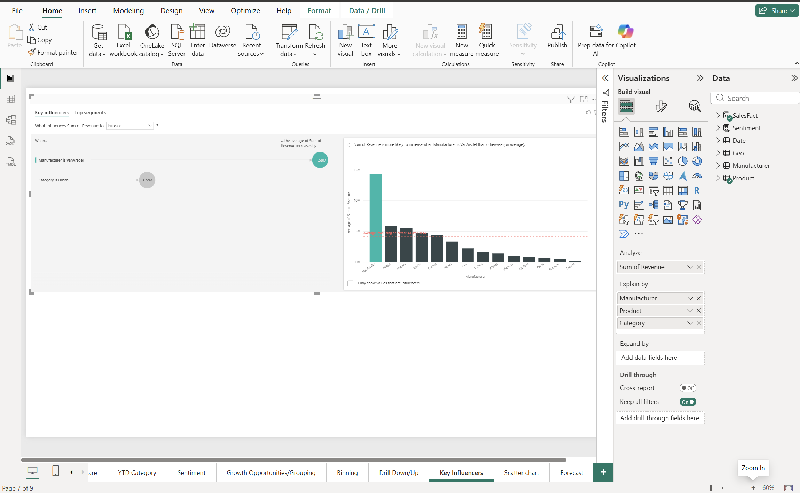
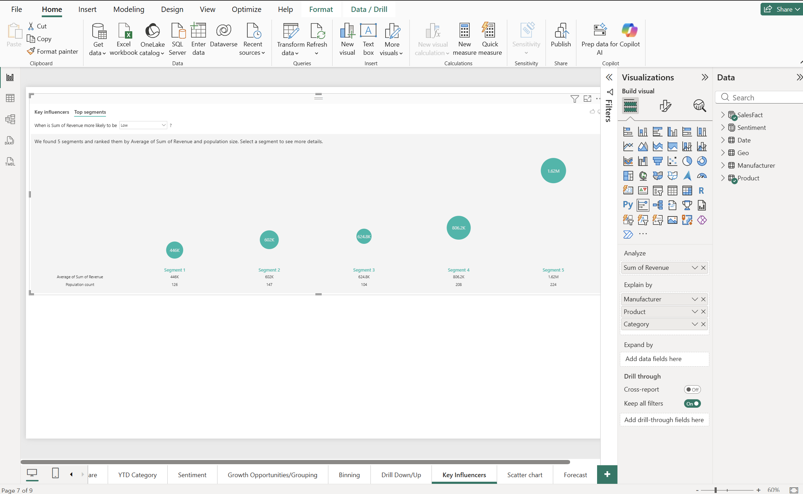
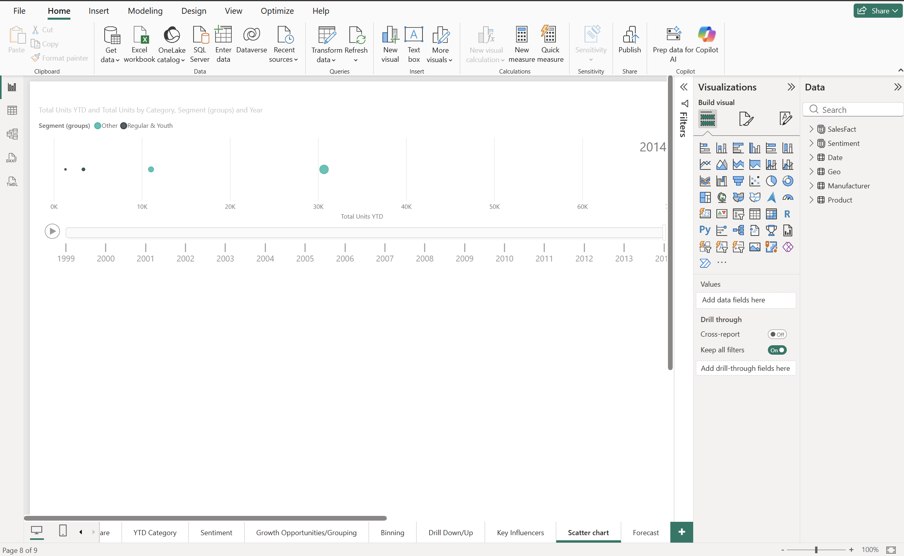
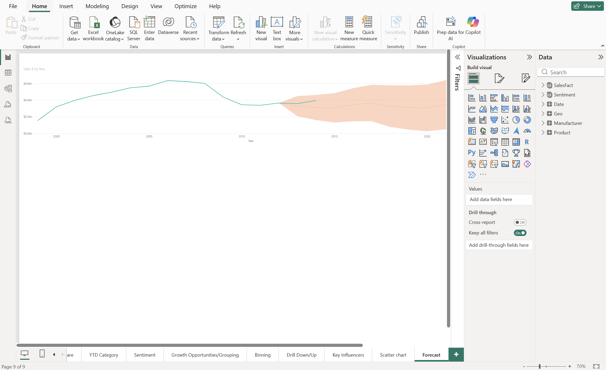

# 03 – Sales & Marketing Analytics

## Goal
Practise Desktop analysis features beyond basic charts: grouping, binning, drill
down/up, AI visuals, forecasting, and animation.

## Note on the file
`Sales_and_Marketing_Sample_PBIX.pbix` is Microsoft's Sales and Marketing sample, which
ships with pre-built pages. The Growth Opportunities page already existed; I added the
grouping to it. The other pages below are ones I created.

## What I built

**Grouping** (Growth Opportunities page) – Grouped the Youth and Regular segments
together to compare them against the rest.

**Binning** – Binned years into five-year ranges and used them as the legend on a
sales-by-region chart.

**Drill down and up** – Built a Region > State > City hierarchy so the chart can be
explored level by level.

**Key influencers** – Analysed what drives revenue up or down, explained by
manufacturer, product, and category.

**Top segments** – The same visual's segment view, showing groups with the highest
or lowest average revenue.

**Animated scatter chart** – Product categories plotted over time with year on the
play axis.

**Forecast** – Line chart with a forecast added from the Analytics pane, adjusting the
forecast length, confidence interval, and seasonality.

## Scope
Done in Power BI Desktop. Custom visuals from AppSource were not used.

## Files
- [`Sales_and_Marketing_Sample_PBIX.pbix`](./Sales_and_Marketing_Sample_PBIX.pbix)